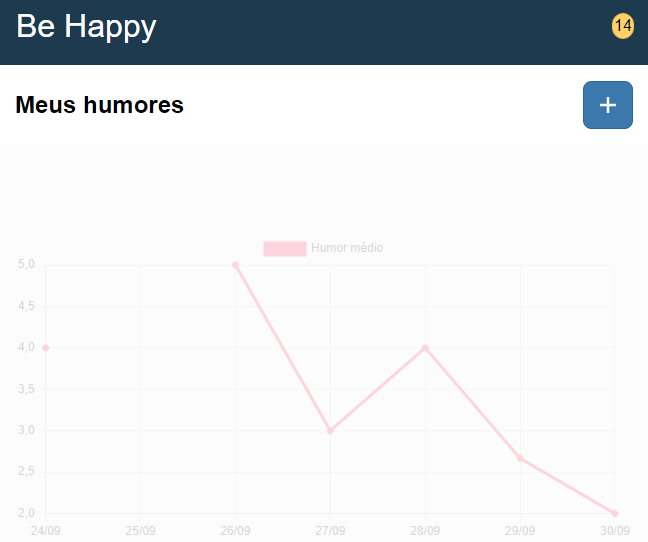
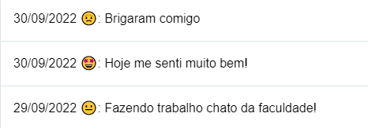

# Be Happy - Aplicativo de Controle de Humor
Um trabalho de Tópicos Especiais em Sistemas de Informação

## Sobre a aplicação

Be Happy é uma aplicação web progressiva para o controle de humor. O objetivo é ter uma visão de como foi seu humor durante a semana e auxiliar a pessoa a ter uma visão sobre como anda sua saúde mental, disponibilizando um relatório da última semana (últimos 7 dias). O usuário pode inserir a data (caso deseje inserir um humor retroativamente em caso de esquecimento), como se sente de 1 a 5 e uma descrição sobre o motivo do humor.

## Prints

## Questionário
- A aplicação é original e não uma cópia da aplicação de um colega ou de uma aplicação já existente?
    Sim. É baseada no aplicativo "Daylio"
- A aplicação tem pelo menos duas interfaces (telas ou páginas) independentes?
   Sim, possui o crud completo (Inserção, alteração, exclusão, visualização completa com gráfico)
- A aplicação armazena e usa de forma relevante dados complexos (mais de um atributo)?
    Sim.
- A aplicação possui um manifesto para instalação no dispositivo do usuário?
    Sim.
- A aplicação possui um service worker que permite o funcionamento off-line?
    Sim.
- O código da minha aplicação possui comentários explicando cada operação?
    Não. Só há comentários explicando o que não foi claro o suficiente em código. A documentação é feita a partir da nomenclatura de métodos e variáveis seguindo as regras de **Clean Code**.
- A aplicação está funcionando corretamente?
    Sim.
- A aplicação está completa?
    Sim.